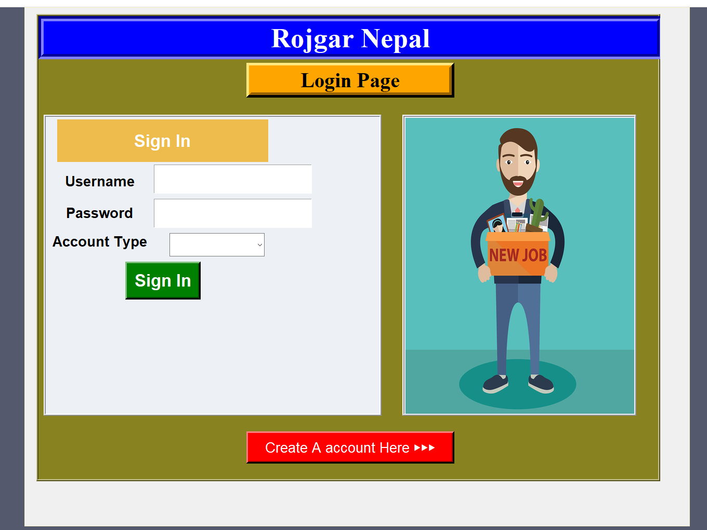
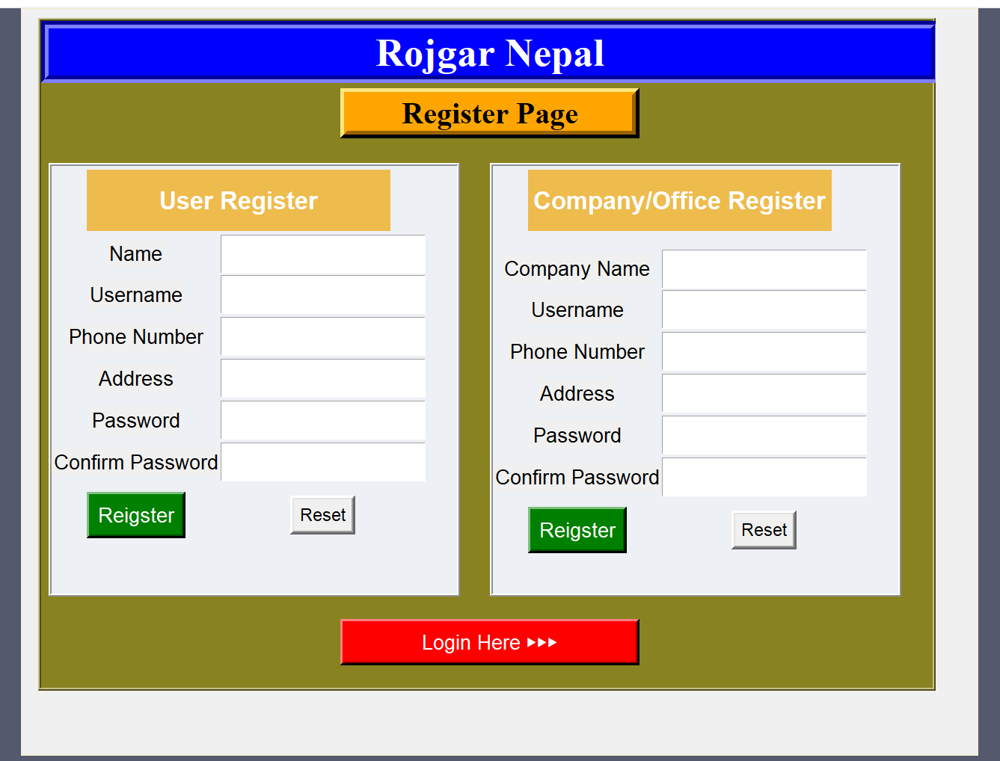
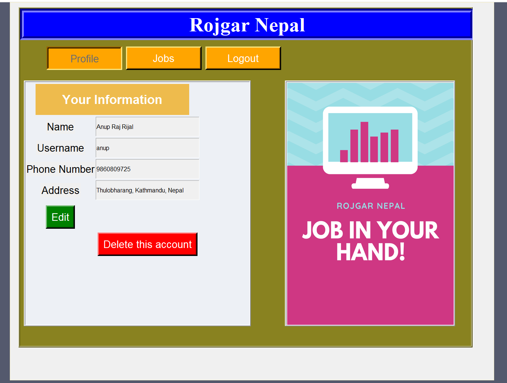
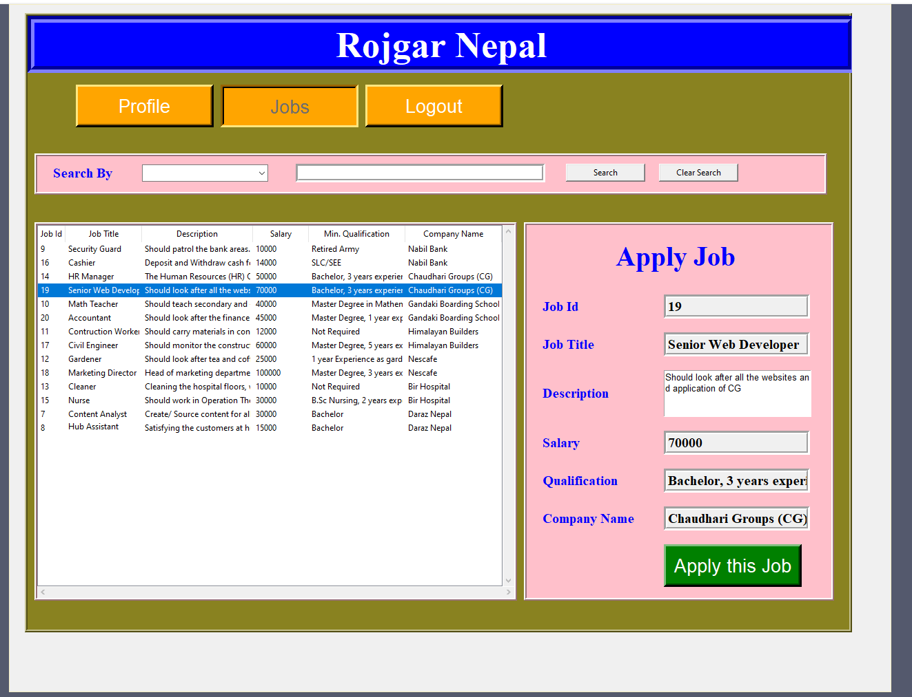
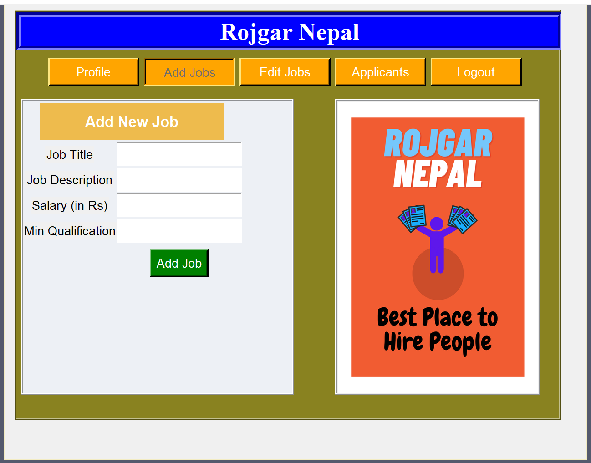
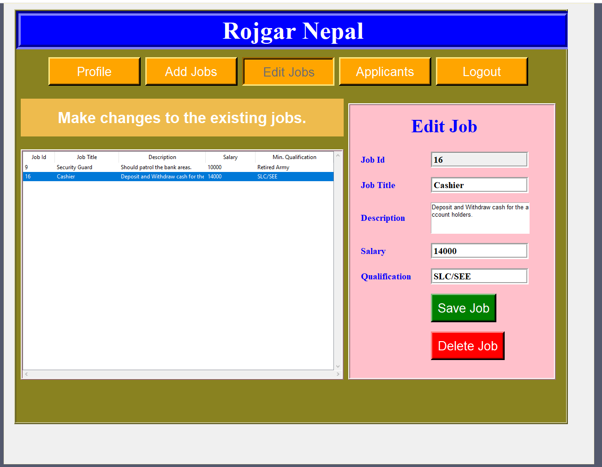
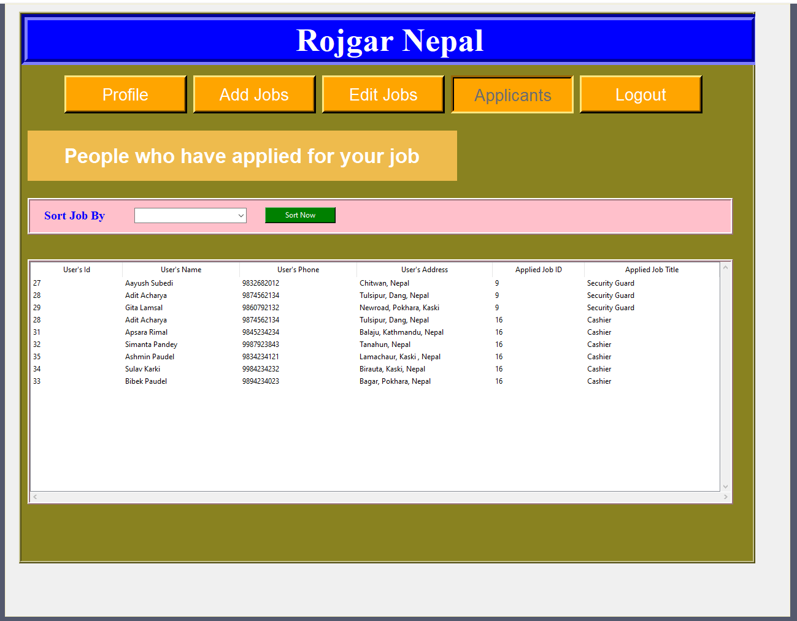

# Rojgar Nepal
> You are not the option job is.

Rojgar Nepal (Employment Nepal) is a GUI application made during the 1st year of my University as a Project.

This application is made using popular __python__ GUI library called **tkinter**. For database **Mysql** is used.

## Introduction
Nepal is a developing country and it is suffering a lot due to unemployment,migrant employment and brain drain problems. Unemployment is increasing day by day in Nepal. The demand and supply situation of human resources in the country is very poorly managed. Every year numerous amount of Nepalese people fly to other countries to seek employment. Over 400,000 young people are estimated to enter the labour force every year. Both skilled and unskilled manpower are the victim of the problem.

Since the lockdown modality has changed a number of companies, factory owners, households, businesses wanted to resume their operations, but are unable to do so because of the workforce migrating out of the cities. This created a 2-way demand supply gap.This demand supply gap has been a problem in Nepal for a long time.

Additionally, due to the COVID-19 impact, many foreign workers have returned to Nepal and in a short period of time they will be seeking for the job opportunity which will be the major problem for the nation to meet. There is an urgent need to solve our labour and employment problem in Nepal.

To solve such a problem, I have planned to create a software or project called “Rojgar Nepal (Employment Nepal)” which will be solving the unemployment problem of Nepal and will try to bring all the foreign workers back home.
I was saddened by the reports of poor and starving migrant workers. While there are jobs and the unemployed workers, there is no mechanism for binding them together. ‘Rojgar Nepal’ tries to do so.

## List of some Features:
1.    Company and office can register as a company and those people seeking a job can register as an employee in the software.
2.    The companies and offices can post for job vacancies in the software.
3.    Users can search for the job in the software.
4.    The user look for the company and job and select the suitable work and apply from home.
5.    The user can send the personal details with their resumes to the company.
6.    The company can contact the person after receiving the person’s details. 

## User Login
### 1. Welcome Screen

### 2. Register Screen

### 3. User Dashboard

### 4. Search for Job & Apply

## Company Login
### 1. Add Job

### 2. Edit Job

### 3. Applicants
